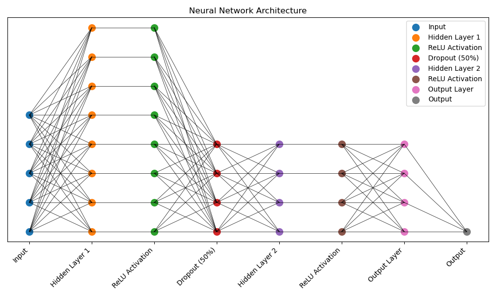

# Neural Network for House Price Prediction

**Oct 2024 - Nov 2024**

[GitHub Repo](https://github.com/AlexSeferidis/ML-Coursework)

## Synopsis

For my Year 3 ML module at Imperial College London I was tasked with:

* Implementing a decision tree algorithm, using it to determine an indoor
location based on WIFI signal strengths collected from a mobile phone.

* Developing and optimised a neural network architecture to predict the price of houses in California using the California House Prices Dataset. 

## Skills

Below are the skills and experiences gained from the project:

* **Implemented the following:**
    * K-NN Classifiers
    * Decision Trees
    * Evaluation of ML models (Confusion matrix, performance metrics, etc)
    * Hyperparameter tuning (dataset split + crossvalidation)
    * Principles of overfitting and mitigation
    * NNs
        * Linear regression
        * Activation functions
        * Backpropagation
        * Gradient Descent
        * Overfitting

* **Competency with the following libraries:**
    * PyTorch
    * Numpy
    * Pandas
    * Scikit-learn

---

